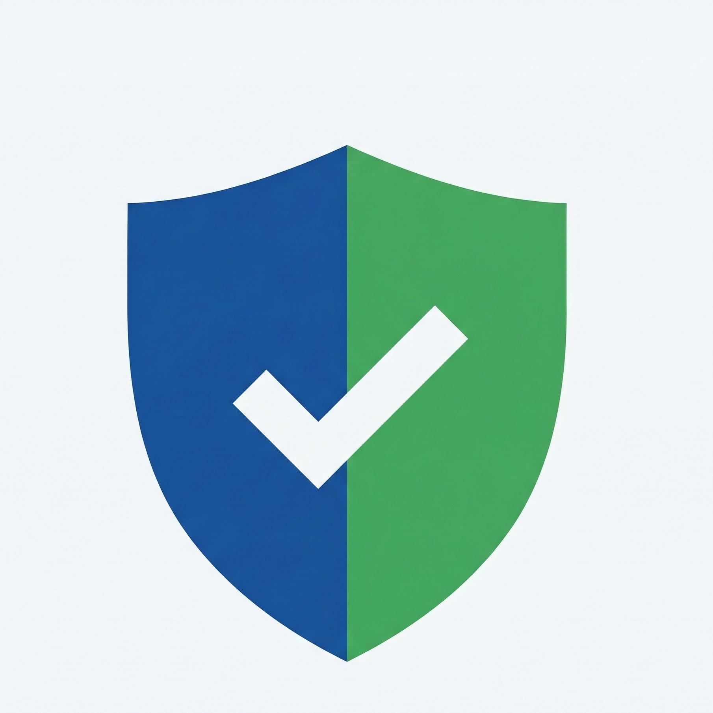

<p align="center">
  
  <h1 align="center">StoreReady</h1>
  <p align="center"><strong>Know before you submit.</strong></p>
  <p align="center">Pre-submission checkup for mobile apps on Google Play and Apple App Store.</p>
</p>

<p align="center">
  <a href="#install">Install</a> &nbsp;&bull;&nbsp;
  <a href="#usage">Usage</a> &nbsp;&bull;&nbsp;
  <a href="#what-it-checks">What It Checks</a> &nbsp;&bull;&nbsp;
  <a href="docs/google-play.md">Google Play Docs</a> &nbsp;&bull;&nbsp;
  <a href="docs/apple-app-store.md">Apple Docs</a> &nbsp;&bull;&nbsp;
  <a href="docs/commands.md">All Commands</a>
</p>

---

## Install

```bash
brew install matrixy/tap/storeready
```

<details>
<summary>Other methods</summary>

```bash
go install github.com/MaTriXy/StoreReady/cmd/storeready@latest
```

```bash
git clone https://github.com/MaTriXy/StoreReady.git
cd StoreReady && make build
```

</details>

## Usage

```bash
storeready playstore-checkup .       # Google Play
storeready appstore-checkup .        # Apple App Store
```

Findings are sorted by severity:

| Level | Meaning |
|-------|---------|
| `CRITICAL` | Will be rejected — must fix |
| `WARN` | High rejection risk — should fix |
| `INFO` | Best practice — consider fixing |

## What It Checks

|  | Google Play | Apple App Store |
|--|------------|----------------|
| **Manifest / config** | AndroidManifest flags, Gradle metadata, package ID | Info.plist, app.json, bundle ID, privacy policy URL |
| **Code patterns** | 30+ rejection-risk patterns across Swift, Kotlin, React Native, Expo | Same scanner, plus private API detection |
| **Permissions** | High-risk Play permissions requiring declarations | Purpose strings, ATT for tracking SDKs |
| **Privacy** | — | PrivacyInfo.xcprivacy, Required Reason APIs |
| **Binary** | — | IPA inspection: icons, size, launch storyboard, ATS |
| **Store API** | — | App Store Connect: metadata, screenshots, builds |
| **Guidelines** | Built-in Play policy matrix | Built-in Apple Review Guidelines |
| **Policy checklist** | Automated + manual review items | Automated + manual review items |

## CI/CD

```yaml
- name: Store compliance check
  run: |
    storeready playstore-checkup . --format json --output play-report.json
    storeready appstore-checkup . --format json --output apple-report.json
```

All commands support `--format json` and `--output <file>` for pipeline integration.

## AI Integrations

**Claude Code:**

```bash
npx skills add https://github.com/MaTriXy/StoreReady --skill "Store Preflight Compliance"
```

**Codex:**

```bash
cp -R codex-skill/* ~/.codex/skills/store-preflight-compliance/
```

Then invoke with `$store-preflight-compliance` in either tool.

---

[Google Play](docs/google-play.md) &nbsp;&bull;&nbsp; [Apple App Store](docs/apple-app-store.md) &nbsp;&bull;&nbsp; [All Commands](docs/commands.md) &nbsp;&bull;&nbsp; [License (MPL-2.0)](LICENSE)
